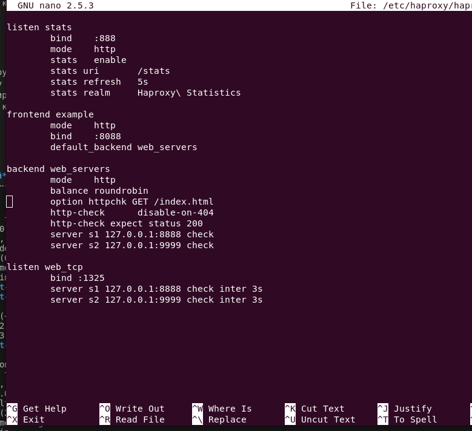

# Домашнее задание к занятию 2 «Кластеризация и балансировка нагрузки»

### Цель задания
В результате выполнения этого задания вы научитесь:
1. Настраивать балансировку с помощью HAProxy
2. Настраивать связку HAProxy + Nginx

------

### Чеклист готовности к домашнему заданию

1. Установлена операционная система Ubuntu на виртуальную машину и имеется доступ к терминалу
2. Просмотрены конфигурационные файлы, рассматриваемые на лекции, которые находятся по [ссылке](2/)

------

### Задание 1
- Запустите два simple python сервера на своей виртуальной машине на разных портах

> Создаем директории и файлы


> Запускаем простой python сервер

Первый сервер на порту 8888 и слушать все сетевые интерфейсы

`python3 -m http.server 8888 --bind 0.0.0.0`


Второй сервер на порту 9999

`python3 -m http.server 9999 --bind 0.0.0.0`


> Проверим доступность обоих серверов


- Установите и настройте HAProxy, воспользуйтесь материалами к лекции по [ссылке](2/)

> Установим haproxy

`sudo apt-get install haproxy`

- Настройте балансировку Round-robin на 4 уровне.

> Добавлена секция в конфигурационный файл `/etc/haproxy/haproxy.cfg`

```
listen web_tcp
        bind :1325
        server s1 127.0.0.1:8888 check inter 3s
        server s2 127.0.0.1:9999 check inter 3s

```



- На проверку направьте конфигурационный файл haproxy, скриншоты, где видно перенаправление запросов на разные серверы при обращении к HAProxy.


### Задание 2
- Запустите три simple python сервера на своей виртуальной машине на разных портах

> Запускаем третий сервер на порту 7777

`python3 -m http.server 7777 --bind 0.0.0.0`


- Настройте балансировку Weighted Round Robin на 7 уровне, чтобы первый сервер имел вес 2, второй - 3, а третий - 4

> Изменяем секцию backend в конфигурационном файл `/etc/haproxy/haproxy.cfg`

```
backend web_servers
        mode    http
        balance roundrobin
        option httpchk GET /index.html
        server s1 127.0.0.1:8888 weight 2
        server s2 127.0.0.1:9999 weight 3
        server s3 127.0.0.1:7777 weight 4
```

- HAproxy должен балансировать только тот http-трафик, который адресован домену example.local

> Изменяем секцию frontend в конфигурационном файл `/etc/haproxy/haproxy.cfg`

```
frontend example
        mode    http
        bind    :8088
#       default_backend web_servers
        acl ACL_example.local hdr(host) -i example.local
        use_backend web_servers if ACL_example.local
```


- На проверку направьте конфигурационный файл haproxy, скриншоты, где видно перенаправление запросов на разные серверы при обращении к HAProxy c использованием домена example.local и без него.


> Файл конфигурации [haproxy.cfg](haproxy.cfg)

---

## Задания со звёздочкой*
Эти задания дополнительные. Их можно не выполнять. На зачёт это не повлияет. Вы можете их выполнить, если хотите глубже разобраться в материале.

---

### Задание 3*
- Настройте связку HAProxy + Nginx как было показано на лекции.
- Настройте Nginx так, чтобы файлы .jpg выдавались самим Nginx (предварительно разместите несколько тестовых картинок в директории /var/www/), а остальные запросы переадресовывались на HAProxy, который в свою очередь переадресовывал их на два Simple Python server.
- На проверку направьте конфигурационные файлы nginx, HAProxy, скриншоты с запросами jpg картинок и других файлов на Simple Python Server, демонстрирующие корректную настройку.

---

### Задание 4*
- Запустите 4 simple python сервера на разных портах.
- Первые два сервера будут выдавать страницу index.html вашего сайта example1.local (в файле index.html напишите example1.local)
- Вторые два сервера будут выдавать страницу index.html вашего сайта example2.local (в файле index.html напишите example2.local)
- Настройте два бэкенда HAProxy
- Настройте фронтенд HAProxy так, чтобы в зависимости от запрашиваемого сайта example1.local или example2.local запросы перенаправлялись на разные бэкенды HAProxy
- На проверку направьте конфигурационный файл HAProxy, скриншоты, демонстрирующие запросы к разным фронтендам и ответам от разных бэкендов.


------

### Правила приема работы

1. Необходимо следовать инструкции по выполнению домашнего задания, используя для оформления репозиторий Github
2. В ответе необходимо прикладывать требуемые материалы - скриншоты, конфигурационные файлы, скрипты. Необходимые материалы для получения зачета указаны в каждом задании.


------

### Критерии оценки

- Зачет - выполнены все задания, ответы даны в развернутой форме, приложены требуемые скриншоты, конфигурационные файлы, скрипты. В выполненных заданиях нет противоречий и нарушения логики
- На доработку - задание выполнено частично или не выполнено, в логике выполнения заданий есть противоречия, существенные недостатки, приложены не все требуемые материалы.